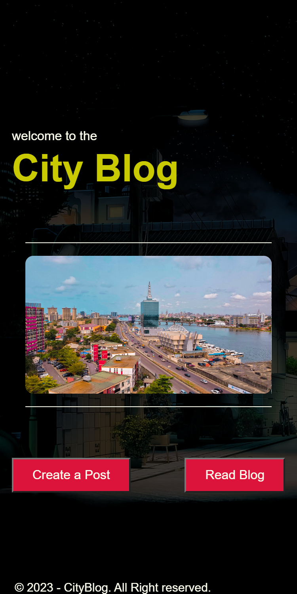

# City Blog App (MOBILE APP CONNECTED TO THE WORDPRES REST API)

## Table of contents

- [Overview](#overview)
- [My process](#my-process)
  - [Built with](#built-with)
  - [Screenshot](#screenshot)
- [Useful Links](#useful-links) 
- [Download/Run and test](#download/run-app) 
- [Author](#author)

## Overview
- Welcome to the City Blog, an adroid version app where to read and know about your city and post about your city.
- This is a Mobile App build on adroid platform using Cordova.  

## My process
- As an assessment to build a Blog Post, After setting up my environment for Cordova. 
- Using a web hosting service (000webhost) and installing wordpress into it, to creates the API on the server and allows the
  client to talk to it. 
- To enable the CORs Support I edited my wp-config.php file in my webhost file manager and add a new constant called 
  JWT_AUTH_CORS_ENABLE "define('JWT_AUTH_CORS_ENABLE', true);" 
- I also  added some lines to my .htaccess file in the webhost.

### Built with
- Html
- CSS custom properties
- Flexbox
- CSS Grid
- Bootstrap
- JavaScript (jquery)

### Screenshot

## Useful links
- Edit file manager - Cc [How to edit webhost file manager](https://github.com/Tmeister/wp-api-jwt-auth)

## download/run-app
- Android Platform - [CityBlog Apk](https://drive.google.com/file/d/1Ib2SEf8ME3LGbTlSY0gWuw0CjcVDKXxx/view?usp=share_link)
- Browser Platform - run "cordova serve" on your terminal 

## Author

- Website - [Adelakun Abayomi](https://adelakunportfolio.netlify.app/)
- GitHub -  [@thisisadelakun](https://github.com/thisisadelakun)
- Twitter - [@thisisadelakun](https://www.twitter.com/thisisadelakun)
